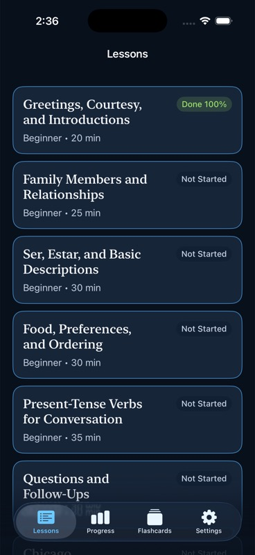
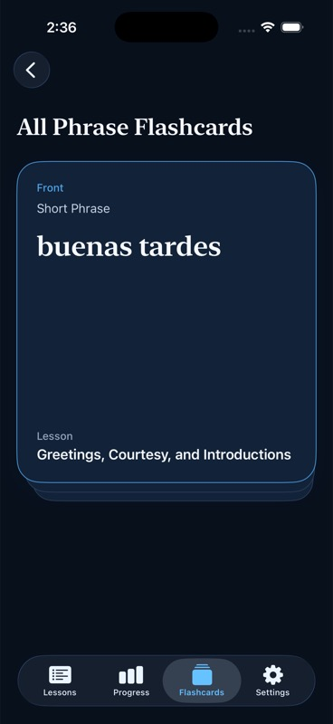

# hermosa

`Hermosa` is a local-first SwiftUI iOS app for learning practical Spanish in family, food, Chicago, church, and everyday-life contexts.

## App Preview

## Current Status

- Bundled XML curriculum loads offline at app launch.
- Lesson list and lesson detail reading surfaces are implemented.
- Tap-only quiz flow is implemented for bundled `multipleChoice` and `multipleSelect` questions.
- Quiz attempts and lesson progress save locally with SwiftData.
- Lesson completion is awarded at `70%` or higher.
- Lesson-level and all-lessons flashcard review is implemented with a reusable stacked deck, vertical flip gestures, and horizontal deck cycling.
- A top-level `Flashcards` tab is live alongside `Lessons`, `Progress`, and `Settings`.
- Progress and settings screens still need their remaining milestone work.

## Project References

- [AGENTS.md](/Users/josh/hermosa/AGENTS.md)
- [HermosaRoadmap.md](/Users/josh/hermosa/HermosaRoadmap.md)
- [HermosaLessonPlan.md](/Users/josh/hermosa/HermosaLessonPlan.md)
- [ImplementationStatus.md](/Users/josh/hermosa/ImplementationStatus.md)

## Current App Shape

- `HermosaApp.swift`: app entry and SwiftData container
- `AppRootView.swift`: top-level app state and tab navigation
- `Hermosa/Data/lesson_plan.xml`: bundled curriculum source
- `Hermosa/Parsing/LessonXMLParser.swift`: XML parsing into plain Swift models
- `Hermosa/Views/LessonDetailView.swift`: lesson reading experience
- `Hermosa/Views/QuizView.swift`: quiz flow and result persistence
- `Hermosa/Views/FlashcardDeckView.swift`: reusable stacked flashcard deck
- `Hermosa/Views/FlashcardsView.swift`: all-lessons flashcard hub
- `Hermosa/Views/ProgressView.swift`: interim progress summary
- `Hermosa/Views/SettingsView.swift`: version metadata with reset still pending

## Remaining Milestones

- Finish the full `P07` progress dashboard
- Implement `P08` review mode
- Add reset-progress behavior in settings
- Complete final accessibility and UI polish
